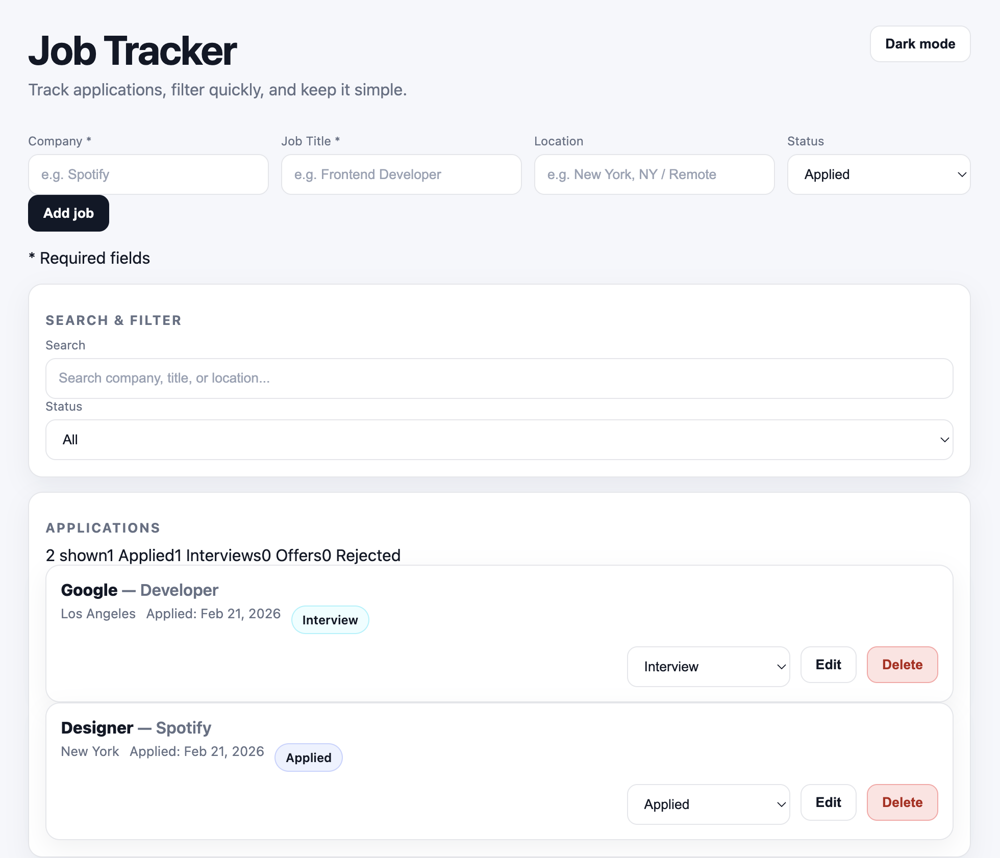

# Job Tracker

A simple job application tracker built with **React + TypeScript**.  
Add applications, update status, search fast, and keep everything saved in the browser.

## 🌐 Live Demo
https://job-tracker-react-two.vercel.app/

## ✨ Features
- Add / edit / delete job applications
- Status tracking: **Applied • Interview • Offer • Rejected**
- Search + filter (company, title, location)
- Dark mode toggle
- Responsive UI
- LocalStorage persistence (data stays after refresh)

## 🛠 Tech Stack
- React
- TypeScript
- Vite
- CSS

## 📸 Preview


## 🚀 Run Locally
```bash
npm install
npm run dev